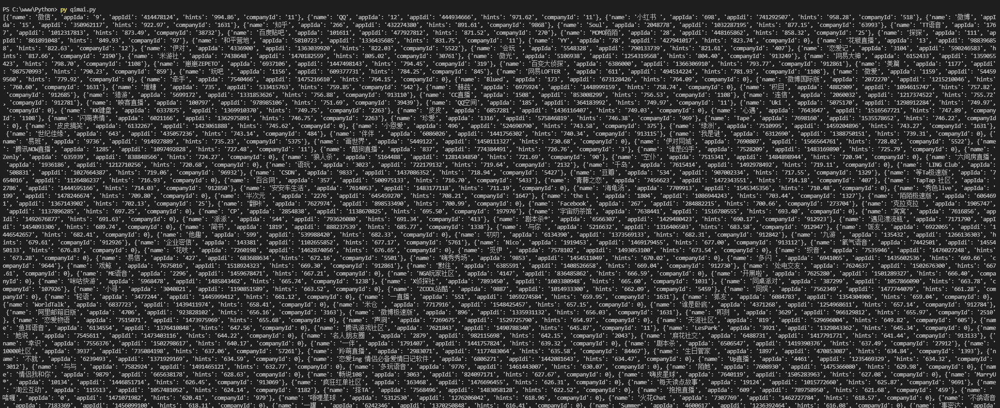
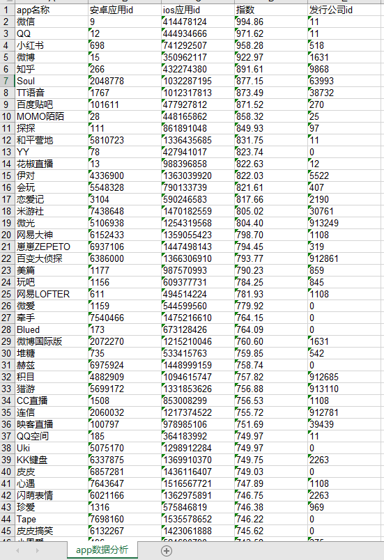
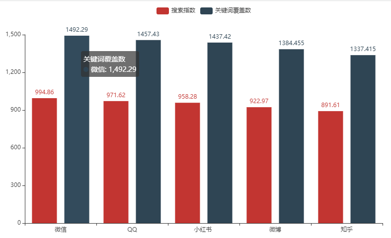

## 安装Python
> https://www.python.org/ftp/python/3.9.10/python-3.9.10-embed-amd64.zip
> 1. 解压后安装，一直点下一步即可  
> 2. 安装成功后右键左下角的windows小旗子  
> 打开"Windows PowerShell(管理员)"  
> 敲打"py" 命令后显示 "Python 3.x.x"代表已经安装成功  
> 其中3.x.x代表python的版本号
> 3. 那么来试试程序员第一行代码吧!
> ```py
> print("Hello World!") #在控制台上打印Hello World
>```

---
### 推荐一些好用的软件
1. vscode: 微软强大的文本编辑器，有非常多的插件可以下载(如代码提示功能，格式化各种编程语言，让代码看起来整齐美观，还能作为本地服务器运行各种语言的脚本)
   > 下载地址: https://en.softonic.com/download/vscode/windows/post-download

----
### 先来了解一下什么是pip?
  pip是python包管理器，很多函数都要依赖各种不同的包
   > 包管理器: 提供各种方法，笼统来讲: 假设你要装修房间，那么python提供了最基础的空间，你还需要加入一些生活桌子、椅子、墙纸等等你组成一个温馨的房间。此时你就要像pip引入一些你想要的东西(前面说到的桌子椅子等)
   >> 举个栗子: python里面用到很多import语句，每次import都将告诉pip你需要这些工具来支撑你的代码运行
   ```py
   import random #这里就向pip引入了random依赖, 不过这个是py自带的了 不需要手动去安装

   #生成1-6的随机整数 
   random.randint(1，6)  #randint: 获取随机整数

   #随机点名一只喵喵起来回答问题 cat是字符串数组
   cat = ['cat1'，'cat2'，'cat3'，'cat4'，'cat5']
   random.choice(cat) #choice: 指定数组中随机返回一个
   ```

## 1. Python基础语法
这里先不多做介绍

## 2. 字符串、列表和字典
定义以及基础使用方法: 这里先不多做介绍  
列表：熟悉列表的增删改查操作，排序等方法即可  
字典：key->value一一对应的数据结构
> 举个栗子: 就像小时候在英语词典上找出不认识的单词, 单词后面就是中文翻译  
> 应用场景: 假设我抓包记录了好几天的数据, 此时我可以新建一个字典  
> >Key代表日期  
> >value代表当日的数据
> ```py
> #在字典中查询3月5号书店的人流量
> data = {  
> '2022/03/05':'100',
> '2022/03/06':'150',
> '2022/03/07':'50'
> }
> print('今天书店有:',data['2022/03/05'],'人')
> 
> #进阶: 人流量从多到小排序 应用sorted()方法
> data2 = sorted(data.items(), key=lambda x: x[1], reverse=True)
> print('人流量最高的日期是:',data2[0][0],' 有',data2[0][1],'人')
> #data2是data排序后的字典, 所以第一个肯定是人数最高的 所以取data2[0]的内容即可
> #额外话: python里面有很多这种高阶函数, 用起来比其他语言方便的多
> ```
## 3.类库和方法
这里先不多做介绍

---


# 实践1: 七麦数据爬虫分析
整体思路:
1. 按需求先建立统计的维度(也就是表头)
2. 进行网络请求把你想要的数据都拿下来(requests): <font color="red">这部分后面再细说, 这里先简单描述</font> 
   1. 建议用chrome浏览器, 按F12->右上角NetWork->选Fecth/XHR(异步请求)查看页面的请求地址
   2. 把请求数据复制到python中进行请求即可返回数据
   3. 有些平台需要登陆的, 要先模拟登陆之后再进行其他操作
3. 把抓回来的数据进行:
   1. 拆解: 只保留你想要的
   2. 合并: 多个页面的数据合并进行多元分析
   3. 封装: 把数据封装成自己看得懂的格式(方便后面操作) 
> 以下是抓取"七麦数据"应用排行榜示例代码  
> iPhone、社交类、免费app https://www.qimai.cn/rank/index/brand/all/genre/6005/device/iphone/country/cn   
> 把排行榜数据存在一个列表(list)里面  
> 并且保留了以下数据:  "应用名""安卓appId""苹果appId""发型公司Id""搜索指数"
```py
#下面涉及的url cookie headers都是可以在chrome下复制下来的 无需手动输入!
#即上面第2.提到的内容 具体后面再独立细说
url = 'https://api.qimai.cn/institute/rank?analysis=ew55QnhndkNSdwFGAVlhWiQbGl9eQ0RZREVEBhhBVApTdRUBAwEDBAYAVQ4HA1Z4Fgc%3D&device=all&type=month&date=&genre=6005'
cookie = 'gr_user_id=bc0e1723-152e-4328-93d3-31002ecd9133; PHPSESSID=dnm6tkbp5un3r1b56jtb6h9ton; qm_check=SxJXQEUSChd2fHd1dRQQeV5EVVwcEHxZRlVVGGYREGV4dBB3QlRHWllaQxQOAgAQdFlCVVZDAXQIARROQ28FbwAQQEZoB28JHBR8A3QBAR0CBRsFAh4IAAQWBgUHBxkSHBdUWlVaWxYCEgAcABwAHAUbAhJE; ada35577182650f1_gr_session_id=3982b4fa-439c-48ac-95a6-95e9466f3008; ada35577182650f1_gr_session_id_3982b4fa-439c-48ac-95a6-95e9466f3008=true; synct=1646471723.009; syncd=-206; tgw_l7_route=1ed618a657fde25bb053596f222bc44a'
headers = {
    "accept": "text/html,application/xhtml+xml,application/xml;q=0.9,image/avif,image/webp,image/apng,*/*;q=0.8,application/signed-exchange;v=b3;q=0.9",
    "accept-language": "zh-CN,zh;q=0.9,en;q=0.8",
    "cache-control": "max-age=0",
    'cookie': cookie,
    "sec-ch-ua": '" Not A;Brand";v="99", "Chromium";v="98", "Google Chrome";v="98"',
    "sec-ch-ua-mobile": "?0",
    "sec-ch-ua-platform": '"Windows"',
    "sec-fetch-dest": "document",
    "sec-fetch-mode": "navigate",
    "sec-fetch-site": "none",
    "sec-fetch-user": "?1",
    "upgrade-insecure-requests": "1",
    "user-agent": 'Mozilla/5.0 (Windows NT 10.0; Win64; x64) AppleWebKit/537.36 (KHTML, like Gecko) Chrome/98.0.4758.102 Safari/537.36'
}
#开始请求
r = requests.get(url=url, headers=headers)

#把抓回来的数据进行 拆解操作(上面3.1提到的)
d = r.json()['appList']

#封装(上面3.3提到的)
list = []
for k in d:
    tmp = {}
    tmp['name'] = k['appInfo']['app_name']
    tmp['appIda'] = k['appInfo']['android_app_id']
    tmp['appIdi'] = k['appInfo']['ios_app_id']
    tmp['hints'] = k['hints']
    tmp['companyId'] = k['company']['id']
    list.append(tmp)
print(list)
```
> 返回截图  
>    
   

# 实践2: 把数据做成excel表格 (xlwt库)
```py
import xlwt #引入excel库
#下面的 list 是实践1抓回来的list
def createExcel():
    wk = xlwt.Workbook("UTF-8")
    ws = wk.add_sheet("app数据分析", cell_overwrite_ok=True) #新建一个表并且命名为app数据分析
    dataHeader = ['app名称', '安卓应用id', 'ios应用id',  '指数', '发行公司id']
    topTen = {"xaxis": [], "hints": []}
    for h in range(0, len(dataHeader)):
        ws.write(0, h, dataHeader[h])  # 设置表头
        ws.col(h).width = 256 * 15  # 设置列狂
    #这里开始数据写入
    for x in range(0, len(list)):
        y = 0
        for k, v in list[x].items():
            ws.write(x+1, y, v)
            y = y + 1
    wk.save("qimaiData.xls")  # 生成excel文件 文件名为:qimaiData.xls
createExcel()
```
> 截图  
>    


# 实践3: 把数据做成丰富的图表 (pyecharts库)
   > 柱状图  
   > 折线图  
   > 时间轴  
   > 词云  
   > 等等等一切excel图表都可以自动生成  
   > <font color="red">高级玩法: 透视表</font> 
```py
#该示例代码是把前5的app的指数生成柱状图
#下面的 list 是实践1抓回来的list
def creatEcharts():
    #保留前5个app的数据
    topTen = {"xaxis": [], "hints": [], "download": []}
    for x in range(0, len(list)):
        if(x < 5):
            topTen["xaxis"].append(list[x]["name"]) #存放app名称
            topTen["hints"].append(list[x]["hints"]) #存放搜索指数
            topTen["download"].append(float(list[x]["hints"])*1.5) #模拟数据
    bar = Bar()
    bar.add_xaxis(topTen["xaxis"]) #柱形图的x轴
    bar.add_yaxis('搜索指数', topTen["hints"]) #柱形图的y轴
    bar.add_yaxis('关键词覆盖数', topTen["download"])
    bar.render('snapshot.html')  # 生成echarts图 snapshot.html
creatEcharts()
```
> 截图  
>    
